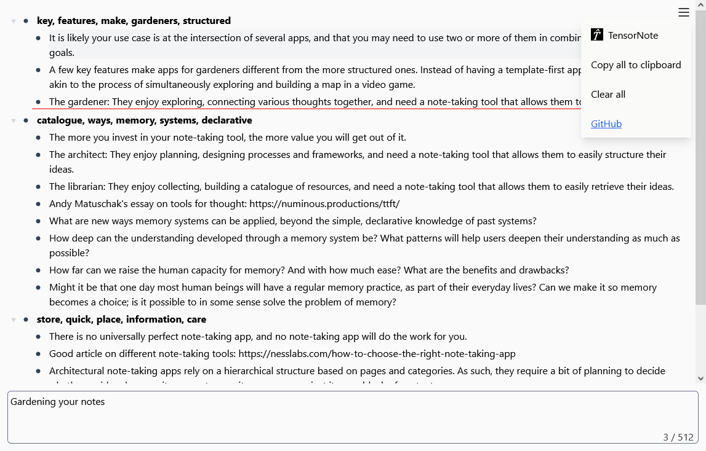

# TensorNote 📝

**TensorNote** is a lightweight notebook that organizes your thinking for you, quickly and efficiently. It is specifically geared for **rapid capture**. By typing whatever you are thinking into the input box, TensorNote's **magic cursor** will steer your train of thought to the right place for saving an idea or finding related notes. As more stuff is added, TensorNote builds a nested list that groups related items. Under the hood, it uses embeddings, clustering, tfidf, and more to reduce the cognitive load and disruption of organizing your notes. It is local-first, so any ideas you have saved will remain with you. Try it out [here](https://drashevsky.github.io/tensornote/)!



## The Information Overload Problem
Today, you can easily Google search anything, from events happening on the other side of the world to the hundreds of options available online for any product of your choosing. The information we can access from our fingertips is gargantuan. Instead of making us more enlightened, however, society is drowning in information. This **information overload** is hampering our ability to think clearly and make good decisions. As the knowledge economy expands and more people interact with increasingly large amounts of information, it helps to have a tool that can cut through the noise and act as a [second brain](https://fortelabs.com/blog/basboverview/). If you want to read more, I've linked some previous [thinking](https://drashevsky.github.io/posts/SecondBrain.html) I've done on this topic.

## Tech Stack
TensorNote is built with **SvelteKit** (_Svelte_ + _TypeScript_ + **Vite**) and **Tailwind** for the frontend. Embeddings and clustering are provided courtesy of [transformers.js](https://huggingface.co/docs/transformers.js/en/index) and **linfa-clustering**, respectively. The backend is built with **Tauri** and **Rust** for the desktop application, while the Rust _wasm-bindgen_ library ports the same functionality to your browser.

## How to Build TensorNote

Make sure that you have ``node``, ``npm``, ``pnpm`` (this project uses it as package manager), ``rustup`` (follow the prompts to install the rust toolchain), and ``wasm-pack``. To check that everything works, run the following commands and ensure they print version numbers:

```
node --version
npm --version
npx --version
pnpm --version
rustup --version
rustc --version
cargo --version
wasm-pack --version
```

Before you build the project, you need to add rustc build targets for webassembly if they aren't already there. To do this, run: ``rustup target add wasm32-unknown-unknown``.

Now you are ready! Clone the repository with: ``git clone https://www.github.com/drashevsky/tensornote.git`` and ``cd`` into the created directory.

Run ``pnpm install`` to install all the necessary dependencies.

To start the Tauri desktop application, run ``pnpm tauri dev``.

To start the web application, run ``pnpm vite dev`` and click on the link printed to go to the webpage.
